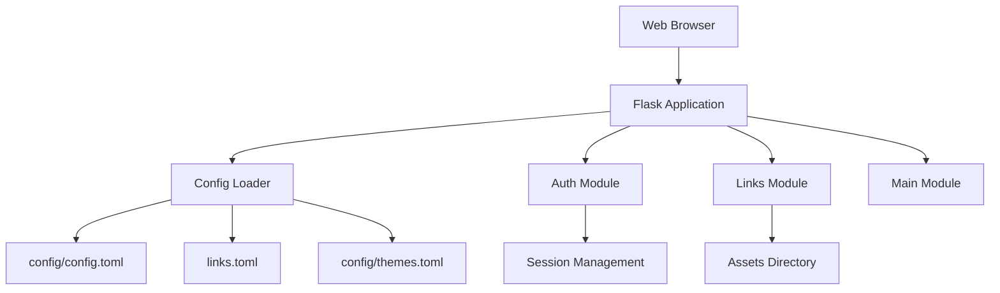
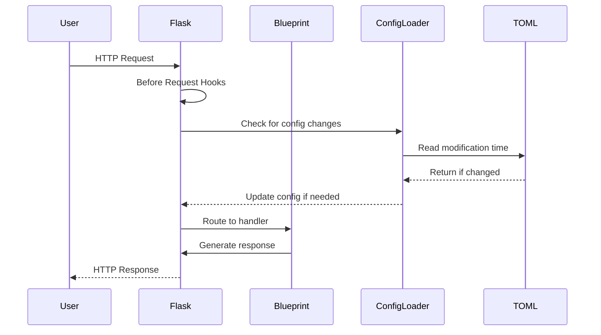
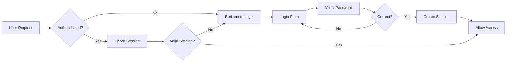

# Architecture

Trunk8 follows a modular Flask architecture using the Blueprint pattern. This document explains the design decisions, component relationships, and architectural patterns used throughout the application.

## High-Level Architecture



## Application Structure

### Core Components

#### Application Factory (`app/__init__.py`)

The application uses the Flask application factory pattern:

```python
def create_app() -> Flask:
    """Application factory pattern for creating Flask app."""
    app = Flask(__name__)
    
    # Configuration
    config_loader = ConfigLoader()
    app.config_loader = config_loader
    
    # Register blueprints
    app.register_blueprint(auth_bp)
    app.register_blueprint(main_bp)
    app.register_blueprint(links_bp)
    
    return app
```

Benefits:

- Easy testing with different configurations
- Multiple instances possible
- Clean separation of concerns

#### Blueprint Architecture

Trunk8 uses Flask Blueprints to organize functionality:

1. **Auth Blueprint** (`app/auth/`)
    - Login/logout functionality
    - Session management
    - Authentication decorators

2. **Links Blueprint** (`app/links/`)
    - CRUD operations for links
    - File handling
    - Link type management

3. **Main Blueprint** (`app/main/`)
    - Home page
    - Settings interface
    - General routes

### Data Flow

#### Request Lifecycle



#### Configuration Management

The `ConfigLoader` class handles all configuration:

```python
class ConfigLoader:
    def __init__(self):
        self.app_config = {}
        self.links_config = {}
        self.themes_config = {}
        self._last_mod_times = {}
    
    def load_configs(self):
        # Check and reload if files changed
        self._load_app_config()
        self._load_links_config()
        self._load_themes_config()
```

Features:

- Automatic reloading on file changes
- Default value creation
- Error handling and recovery

## Design Patterns

### Model-View-Controller (MVC)

While Flask doesn't enforce MVC, Trunk8 follows MVC principles:

- **Models**: `Link` class in `app/links/models.py`
- **Views**: Jinja2 templates in `app/templates/`
- **Controllers**: Route handlers in blueprints

### Decorator Pattern

Custom decorators for cross-cutting concerns:

```python
@auth_bp.route('/login', methods=['GET', 'POST'])
def login():
    # Login logic
    
@main_bp.route('/')
@login_required  # Custom decorator
def index():
    # Protected route
```

### Factory Pattern

Used for creating application instances and links:

```python
# Application factory
app = create_app()

# Link creation
link = Link(short_code, link_data)
```

## Security Architecture

### Authentication Flow



### Session Management

- Flask-Session for server-side sessions
- Configurable session lifetime
- Secure cookie settings in production

### Password Protection

- Environment variable for admin password
- No default passwords in code

## File Handling Architecture

### Upload Process

1. **File Reception**: Multipart form data
2. **Security Check**: File type validation
3. **Name Generation**: UUID-based secure names
4. **Storage**: Local filesystem (configurable)
5. **Link Creation**: Database entry with metadata

### Storage Strategy

```
assets/
├── 7f3e4a89-1234-5678-9abc-def012345678.pdf
├── 8a9b7c6d-5432-1098-fedc-ba9876543210.jpg
└── 9e8f7d6c-5b4a-3921-0edc-1a2b3c4d5e6f.md
```

Benefits:

- No filename collisions
- Security through obscurity
- Easy cleanup of orphaned files

## Performance Considerations

### Caching Strategy

1. **Configuration Caching**
    - Only reload on file changes
    - Track modification times
    - In-memory storage

2. **Static File Serving**
    - Let web server handle in production
    - Flask development server for testing

### Scalability

Current architecture supports:

- Horizontal scaling (stateless design)
- Load balancing (with shared storage)
- CDN integration for static assets

Future considerations:

- Database backend for links
- Redis for session storage
- S3-compatible object storage

## Extension Points

### Adding New Link Types

1. Create handler in `app/links/routes.py`
2. Add type validation
3. Update templates
4. Document in configuration

Example:
```python
def handle_video_link(link_data):
    """Handle video streaming links."""
    # Implementation
```

### Custom Authentication

Replace password auth with:

- OAuth2/OIDC
- LDAP/Active Directory
- Multi-factor authentication

### Storage Backends

Abstract storage interface:
```python
class StorageBackend(ABC):
    @abstractmethod
    def save(self, file_data): pass
    
    @abstractmethod
    def retrieve(self, file_id): pass
    
    @abstractmethod
    def delete(self, file_id): pass
```

## Technology Stack

### Core Dependencies

- **Flask**: Web framework
- **Gunicorn**: WSGI server
- **TOML**: Configuration format
- **Jinja2**: Template engine

### Frontend Stack

- **Bootstrap**: CSS framework
- **Bootswatch**: Theme library
- **StrapDown.js**: Markdown rendering
- **Vanilla JavaScript**: Minimal dependencies

## Development Principles

### Code Organization

```
app/
├── __init__.py      # App factory
├── auth/            # Authentication
├── links/           # Core functionality
├── main/            # General routes
├── utils/           # Shared utilities
├── static/          # CSS, JS, images
└── templates/       # HTML templates
```

### Testing Strategy

- Unit tests for models and utilities
- Integration tests for routes
- End-to-end tests for workflows
- Mocking for external dependencies

### Error Handling

Graceful degradation at all levels:

- Missing configuration files
- Invalid TOML syntax
- File system errors
- Network failures

## Future Architecture Goals

### API-First Design

RESTful API for all operations:
```
GET    /api/links
POST   /api/links
GET    /api/links/{code}
PUT    /api/links/{code}
DELETE /api/links/{code}
```

## Conclusion

Trunk8's architecture prioritizes:

- **Simplicity**: Easy to understand and modify
- **Security**: Defense in depth approach
- **Flexibility**: Extensible design patterns
- **Performance**: Efficient resource usage
